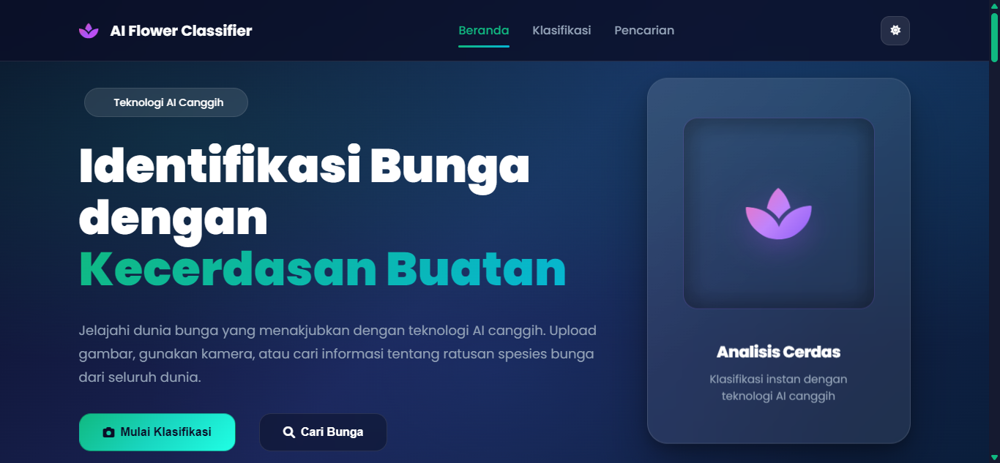

# 🌺 AI Flower Classifier - Klasifikasi Jenis Bunga (Flask + TensorFlow)

[](https://github.com/your-repo)  

*Aplikasi web canggih untuk mengklasifikasikan jenis bunga dari gambar (upload file atau kamera), menampilkan confidence, serta menampilkan metadata/penjelasan bunga yang detail dan informatif.*



---

## 📋 Daftar Isi

- [🎯 Highlights](#-highlights)
- [🛠️ Tech Stack](#️-tech-stack)
- [📂 Struktur Project](#-struktur-project)
- [📦 Dataset](#-dataset)
- [📋 Requirements](#-requirements)
- [🚀 Quickstart](#-quickstart)
- [⚙️ Konfigurasi & Batasan](#️-konfigurasi--batasan)
- [🔌 API Ringkas](#-api-ringkas)
- [🌐 Production Notes](#-production-notes)
- [📄 License](#-license)

## ✨ Highlights

- **🌐 Web UI** yang intuitif (HTML templates) untuk beranda, klasifikasi, dan pencarian yang mudah digunakan.
- **🔗 API JSON** yang powerful untuk:
  - 📤 Upload gambar (`/upload`)
  - 📷 Capture kamera (`/capture`)
  - 🔍 Pencarian metadata bunga (`/api/search`)
- **🤖 Model inference** menggunakan TensorFlow/Keras (`.keras`) dan utilitas prediksi di `models/model_utils.py` untuk akurasi tinggi.
- **🔍 Validasi kualitas gambar** (brightness & blur) untuk mengurangi prediksi pada gambar yang tidak layak dan meningkatkan keandalan.

---

## 🛠️ Tech Stack

| Komponen          | Teknologi                          | Deskripsi |
|-------------------|------------------------------------|-----------|
| **Backend**      | **Flask** 🐍                      | Framework web Python yang ringan dan fleksibel |
| **ML Inference** | **TensorFlow** (memuat model Keras) 🤖 | Library machine learning untuk model deep learning |
| **Image Processing** | **Pillow**, **OpenCV**, **NumPy** 🖼️ | Tools untuk manipulasi dan analisis gambar |

---

## 📂 Struktur Project

```
flower_ai/
├── app.py                         # 🚀 Aplikasi Flask utama, routing + API
├── models/                        # 📊 Folder model dan data
│   ├── flower_classification_model_MobileNetV2.keras          # 🧠 Model terlatih
│   ├── model_utils.py              # ⚙️ Fungsi prediksi + quality check
│   ├── cat_to_name.json            # 🏷️ Mapping kelas -> nama bunga
│   ├── class_indices.json          # 🔢 Mapping index model -> label folder
│   └── flower_metadata.json        # 📖 Metadata lengkap (nama ilmiah, habitat, dll)
├── templates/                     # 🎨 Halaman UI (Jinja2)
│   ├── index.html                  # 🏠 Beranda
│   ├── clasify.html                # 🔍 Klasifikasi
│   └── search.html                 # 🔎 Pencarian
├── static/                        # 🎯 Static assets
│   ├── ss_home.png                 # 🖼️ Screenshot Home
│   ├── favicon.png                 # 🖼️ Favicon
│   ├── style.css                   # 🎨 Styling
│   └── script.js                   # ⚡ JavaScript
├── requirements.txt               # 📦 Dependensi Python
├── LICENSE                        # 📄 Lisensi (MIT)
├── README.md                      # 📚 Dokumentasi utama
└── USAGE.md                       # 📖 Panduan penggunaan
```

---

## 📦 Dataset
Dataset sumber: Kaggle - [Oxford 102 Flower Dataset](https://www.kaggle.com/datasets/nunenuh/pytorch-challange-flower-dataset)

Ringkasan singkat:

- Dataset berisi 102 kategori bunga (setiap kelas berkisar 40–258 gambar) dengan variasi besar pada skala, pose, dan pencahayaan. Beberapa kategori sangat mirip sehingga menantang untuk klasifikasi.

Struktur direktori:

```
> dataset
	> train
	> valid
	> test
- cat_to_name.json
- README.md
- sample_submission.csv
```

---

## 📋 Requirements

- **🐍 Python**: **3.10+** *(pastikan kompatibel dengan versi TensorFlow yang di-install di OS kamu)*
- **📦 Dependensi Python**: Lihat `requirements.txt` untuk daftar lengkap

---

## 🚀 Quickstart

Ikuti langkah-langkah berikut untuk menjalankan aplikasi dengan cepat:

1. **🏗️ Buat dan aktifkan virtual environment**
   ```bash
   python -m venv .venv
   # Windows PowerShell
   .\.venv\Scripts\Activate.ps1
   ```

2. **📥 Install dependency**
   ```bash
   pip install -r requirements.txt
   ```

3. **▶️ Jalankan server**
   ```bash
   python app.py
   ```

4. **🌐 Buka di browser**
   - **🏠 UI**: `http://localhost:5000/`
   - **🔍 Klasifikasi**: `http://localhost:5000/clasify`
   - **🔎 Search**: `http://localhost:5000/search`

---

## ⚙️ Konfigurasi & Batasan

- **📏 Maks ukuran upload**: **10 MB** (`MAX_CONTENT_LENGTH`)
- **🖼️ Ekstensi yang diizinkan**: `png`, `jpg`, `jpeg`, `bmp`
- **📁 File model dan metadata**: Dibaca dari folder `models/`
- **🏷️ Mapping kelas**:
  - **Utama**: `models/class_indices.json` (mapping yang sama seperti saat training)
  - **Fallback**: Folder dataset `../dataset/train` (jika tersedia)
  - **Fallback terakhir**: Urutan key dari `models/cat_to_name.json`

---

## 🔌 API Ringkas

| Endpoint | Method | Deskripsi |
|----------|--------|-----------|
| `/upload` | `POST` | 📤 Upload gambar dari file (multipart/form-data) |
| `/capture` | `POST` | 📷 Capture dari kamera (JSON base64) |
| `/api/search` | `POST` | 🔍 Search metadata bunga (JSON query) |

*Detail lengkap request/response dan contoh curl ada di [`USAGE.md`](USAGE.md).*

---

## 🌐 Production Notes

- **🚫 Jangan jalankan dengan `debug=True` di production** untuk alasan keamanan.
- **🚀 Untuk deployment**, jalankan via WSGI server pilihan Anda (mis. gunicorn/waitress) dan atur reverse proxy (Nginx/IIS) sesuai kebutuhan.

- **🌍 Demo (Deployment)**: [sanproz.up.railway.app](https://sanproz.up.railway.app/)

---

## 📄 License

**MIT License** 📜  
Lihat file [`LICENSE`](LICENSE) untuk detail lebih lanjut.

---

## 🎉 Project Completed!

Proyek **Flower AI** telah berhasil diselesaikan dengan fitur lengkap untuk klasifikasi bunga menggunakan AI. Terima kasih telah menggunakan aplikasi ini! 🌸
